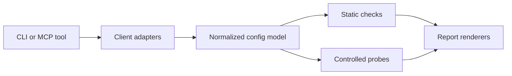

# Architecture

Agent Plugin Diagnostics is organized around a small domain model and separate edge modules.

## Flow

## Modules

`core`

Domain models, rule metadata, utility functions, and workflow orchestration.

`clients`

Client-specific discovery and parsing for Claude Code, Codex, Cursor, VS Code, and Windsurf.

`checks`

Deterministic checks that inspect normalized configs and emit findings.

`probes`

Controlled MCP protocol probes. Probes run initialize, ping, tools/list, and optional prompts/resources lists when the server advertises those capabilities. Remote HTTP and SSE probes are opt-in through `apd probe --remote`.

`reports`

Terminal, JSON, Markdown, and SARIF renderers. Secret redaction happens before machine-readable report output.

`fixers`

Fix-plan generation. Automatic config mutation is intentionally left out until the project has broader coverage.

`mcp_server`

Optional MCP server mode built on the official Python MCP SDK. The package installs this surface through the `mcp` extra.

## Extension Points

Add a client by implementing `ClientAdapter`.

Add a check by returning findings from a class that satisfies the `Check` protocol.

Add a report format by creating a renderer that consumes `DiagnosticReport`.

The CLI and MCP server should stay thin. They should call workflow functions rather than owning diagnostic behavior.
